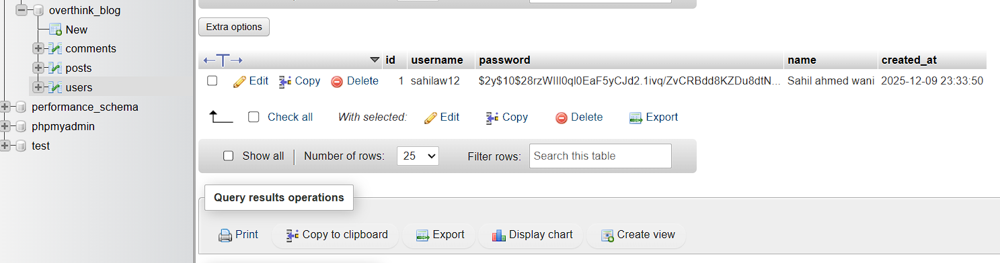
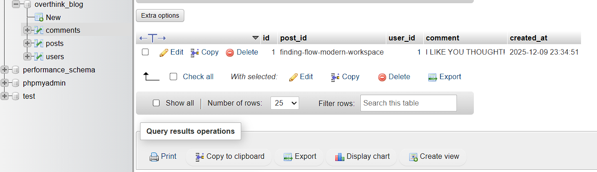

# OverThink Blog Website

A dynamic blog platform built with PHP, MySQL, and JavaScript featuring user authentication, search functionality, and commenting system.

### Live
website link: https://overthink-website.lovestoblog.com/main.php

## Features
- **User Authentication** - Sign up, login, and logout functionality with secure password hashing
- **Dynamic Blog Posts** - Each post loads unique content from the database
- **Search Functionality** - Search posts by title, content, or excerpt
- **Comment System** - Logged-in users can comment on posts
- **Responsive Design** - Clean, mobile-friendly layout using Flexbox and CSS Grid

## Pages Included
- `main.php` – Home page with hero section, featured posts, and article grid
- `post.php` – Dynamic post page displaying content based on slug parameter

## Tech Stack
- **Frontend**: HTML, CSS, JavaScript
- **Backend**: PHP
- **Database**: MySQL
- **Server**: XAMPP (Apache + MySQL)

## Database Structure

### Users Table
Stores registered user accounts with hashed passwords.



### Comments Table
Stores user comments linked to posts and users.



## Project Structure
```
overthink-blog-assignment/
├── api/
│   ├── comments.php    # Handle comment CRUD operations
│   ├── login.php       # User authentication
│   ├── logout.php      # Session destruction
│   ├── search.php      # Search posts
│   └── signup.php      # User registration
├── config/
│   └── database.php    # Database connection
├── images/             # Image assets
├── js/
│   ├── main.js        # Home page JavaScript
│   └── post.js        # Post page JavaScript
├── database.sql       # Database schema and seed data
├── main.php           # Home page
├── post.php           # Dynamic post page
├── style.css          # Global styles
└── README.md          # This file
```

## Key Features Implementation

### Authentication System
- Secure password hashing using PHP's `password_hash()`
- Session management for logged-in users
- Modal-based login/signup forms

### Dynamic Content
- Posts are fetched from database based on URL slug parameter
- Content formatting with automatic heading detection
- Image handling with fallback support

### Search Functionality
- Real-time search across post titles, content, and excerpts
- Results displayed dynamically without page reload

### Comment System
- Only authenticated users can post comments
- Comments display username and timestamp
- Real-time comment loading via AJAX
